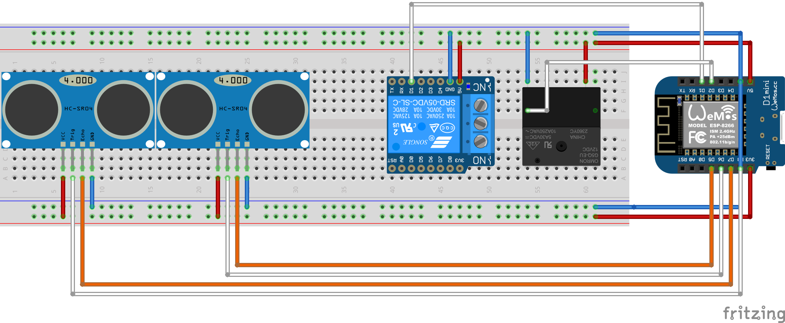

# garagedoors-mqtt-arduino
An alternative to [OpenGarage](https://opengarage.io) that uses ultrasonic sensors to send status of garage doors over MQTT and controls relays to open/close doors. It can be integrated in [Home Assistant](https://home-assistant.io) or any other home automation platform that supports MQTT. Can be extended to more than two doors.

Since OpenGarage only supports one door per install and I had trouble with [ESPHome](https://esphome.io) to work with my two sensors consistently, I decided to create my own. The Arduino ESP8266 sketch in this repo allows you to build a solution that will send the status of two ultrasonic sensors over MQTT (which can be translated to the status of the garage doors in the consuming application, not included in this solution). Also, this sketch receives commands through MQTT and toggles relays to open/close the doors.

## Hardware
- Wemos D1 Mini. You can use any equivalent but you will most likely have to update the code to match the pins.
- US-100 or HC-SR04 ultrasonic sensors, one per door. This sketch assumes two (two doors). If using US-100 make sure to remove the jumper on the sensor.
- Relays, either the Wemos D1 Mini relay shield (I used the relay shield for the right door) or any other 5v/3v relay (I used a general relay for the left door). This sketch assumes two (two garage door controllers).

## Wiring
See the image below and [the Fritzing diagram](double%20garagedoor%20Arduino.fzz). If you like to read instead of looking at an image (who would?) - here is the list of connections to make:
- Wemos 3V --> VCC of ultrasonic sensors (2x)
- Wemos GND --> GND of ultrasonic sensors (2x)
- Wemos GND --> GND of relays (2x)
- Wemos 5V --> VCC of relays (2x)
- Wemos D1 --> D1 of relay 1 (right door)
- Wemos D2 --> SIG of relay 2 (left door)
- Wemos D5 --> echo/rx of ultrasound (right door)
- Wemos D6 --> trigger of ultrasound (right door)
- Wemos D7 --> echo/rx of ultrasound (left door)
- Wemos D8 --> trigger of ultrasound (left door)



## Software
[The sketch](GarageDoorsArduino.ino) supports over-the-air (OTA), but you will first 'prime' your chip with the OTA software as instructed here [Arduino OTA](https://arduino-esp8266.readthedocs.io/en/latest/ota_updates/readme.html). After that you can deploy this sketch and any updates OTA.

### Requirements
- [Arduino_JSON](https://github.com/arduino-libraries/Arduino_JSON)
- [HCSR04](https://github.com/gamegine/HCSR04-ultrasonic-sensor-lib)
- [ESP8266WiFi](https://arduino-esp8266.readthedocs.io/en/latest/esp8266wifi/readme.html)
- [PubSubClient](https://pubsubclient.knolleary.net/)
- [ArduinoOTA](https://github.com/esp8266/Arduino/tree/master/libraries/ArduinoOTA)

### Configuration

You will probably need to make the following edits in the sketch:
|Line | Setting | Default|
| --- | --- | --- |
|13|configure the hostname you want your esp8266 to have on your network|garagedoors|
|14|configure the password you will use when uploading updates using OTA|password|
|18/19|configure the pin (trigger pin, echo pin) for your ultrasonic sensors. Two have been provided, add more here if you need them|12,14 and 15,13|
|22|time in seconds between each update of sensor status on MQTT|30 seconds|
|27|Your WiFi SSIS|MyWiFi|
|28|Your WiFi security key|NotSecure|
|35|The IPAddress of your MQTT server, with components separated by ',' instead of '.'|192,168,1,2|
|38|The user to login to the MQTT server|user|
|39|The password to login to the MQTT server|password|
|40|The topic you will receive commands on. Command is expected to look like: ```{"door": "left","command":"open"}``` and needs to be valid JSON. `door = left` will map to the left garage door, `door = right` to the right one. `command = open` will open the door, `command = close` will close the door. command is ignored since we only need to know which relay (door) to toggle this assumes you will never send a command while the door is still in motion. |garagedoors/command|
|42/43|The topics two write the sensor status to, one per door. Two have been provided, add more here if you need them.|garagedoors/right, garagedoors/left|
|50/51|The pins for your relays. Two have been provided, add more here if you need them.|D1,D2|
|56|Duration (in milliseconds) to close the switch on the door opener. This should be long enough for the mechanism to start; typically it doesn't to remain activated for the door to complete its motion. It is the same as the time you'd hold down the button to start the door moving.|600|
|105-112|Add more if/else if/else constructs if you need to control more than two doors|N/A|
|190/191|Add initialization of more relay pins if you need to control more than two doors|N/A|
|215-220|Add code to read and publish ultrasonic sensor readings in the corresponding MQTT topics if you need to control more than two doors|N/A|

## Home Assistant configuration
Since I kept the work in the Arduino sketch to a minimum as possible there are quite some things to configure in Home Assistant. This is my config (all for two doors):
```yaml
input_number: #these are used to make the state switching configurable in the UI
  garage_door_closed_distance_setting: 
      name: Garage Door Closed Distance Setting
      min: 0
      max: 1000
      step: 1
      mode: box
  garage_door_vehicle_present_distance_setting:
      name: Garage Door Vehicle Present Distance Setting
      min: 0
      max: 1000
      step: 1
      mode: box
sensor:
  - platform: mqtt
    name: Garage Door Distance Left
    state_topic: "garagedoors/left"
    icon: mdi:altimeter
    unit_of_measurement: cm
  - platform: mqtt
    name: Garage Door Distance Right
    state_topic: "garagedoors/right"
    icon: mdi:altimeter
    unit_of_measurement: cm
  - platform: template
    sensors:
      garagedoor_left_state:
        friendly_name: Left Garage Door State
        value_template: " Closed  Vehicle Present  Open "
        icon_template: " mdi:garage  mdi:garage-alert  mdi:garage-open "
      garagedoor_right_state:
        friendly_name: Right Garage Door State
        value_template: " Closed  Vehicle Present  Open "
        icon_template: " mdi:garage  mdi:garage-alert  mdi:garage-open "
cover:
  - platform: template
    covers:
      garage_door_left:
        friendly_name: Garage Door Left
        value_template: "{{ is_state('sensor.garagedoor_left_state','Open')}}"
        open_cover:
          service: mqtt.publish
          data:
            topic: garagedoors/command
            payload: '{"door":"left", "command":"open"}'
            retain: false
        close_cover:
          service: mqtt.publish
          data:
            topic: garagedoors/command
            payload: '{"door":"left", "command":"close"}'
            retain: false
        stop_cover: 
          service: mqtt.publish
          data:
            topic: garagedoors/command
            payload: '{"door":"left", "command":"stop"}'
            retain: false
      garage_door_right:
        friendly_name: Garage Door Right
        value_template: "{{ is_state('sensor.garagedoor_right_state','Open')}}"
        open_cover:
          service: mqtt.publish
          data:
            topic: garagedoors/command
            payload: '{"door":"right", "command":"open"}'
            retain: false
        close_cover:
          service: mqtt.publish
          data:
            topic: garagedoors/command
            payload: '{"door":"right", "command":"close"}'
            retain: false
        stop_cover: 
          service: mqtt.publish
          data:
            topic: garagedoors/command
            payload: '{"door":"right", "command":"stop"}'
            retain: false
```

In the UI, these are the cards that I added:

Left door:
```yaml
entities:
  - entity: cover.garage_door_left
  - entity: sensor.garagedoor_left_state
  - entity: sensor.garage_door_distance_left
show_header_toggle: false
title: Left Garage Door
type: entities
```

Right door:
```yaml
entities:
  - entity: cover.garage_door_right
  - entity: sensor.garagedoor_right_state
  - entity: sensor.garage_door_distance_right
show_header_toggle: false
title: Right Garage Door
type: entities

```